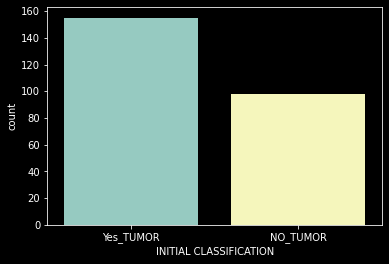
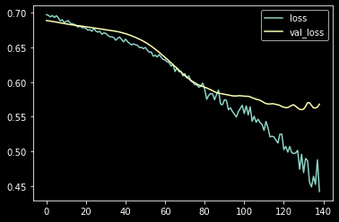
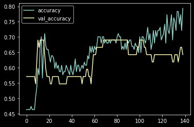

  
# Deep_learning_classification_tumor_detection
Tumore detection is very important task in medical imaging. I have shown how deep learning can help us to detect brain tumors from MRI images.

The histogram indicating the images with and without tumor is being shown in the following:

4 MRI images have been visualized with and without tumor:

Training loss and validation loss after 139 epoch:

Training accuracy and validation accuracy after 139 epoch:

`DISCLAIMER`: I don't warrant this code in any way whatsoever. This code is provided "as-is" to be used at your own risk.
